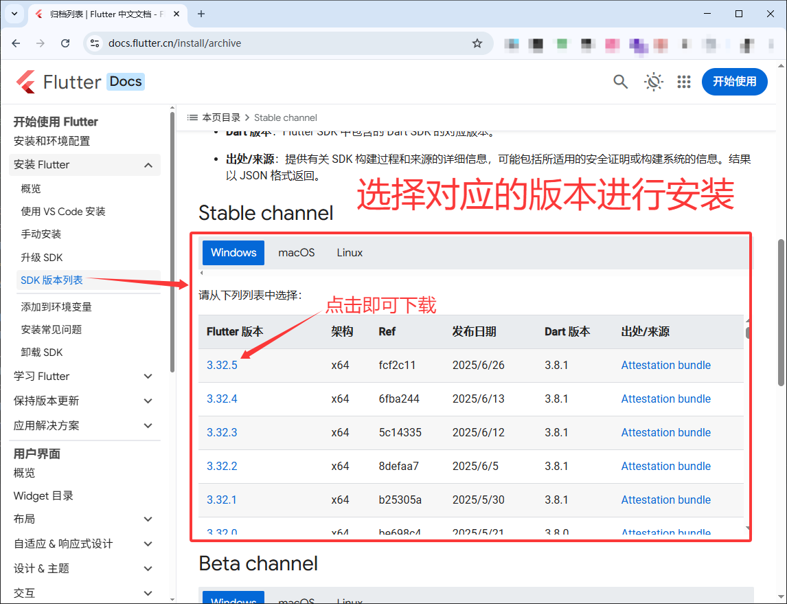
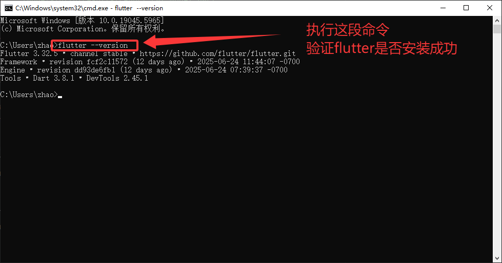
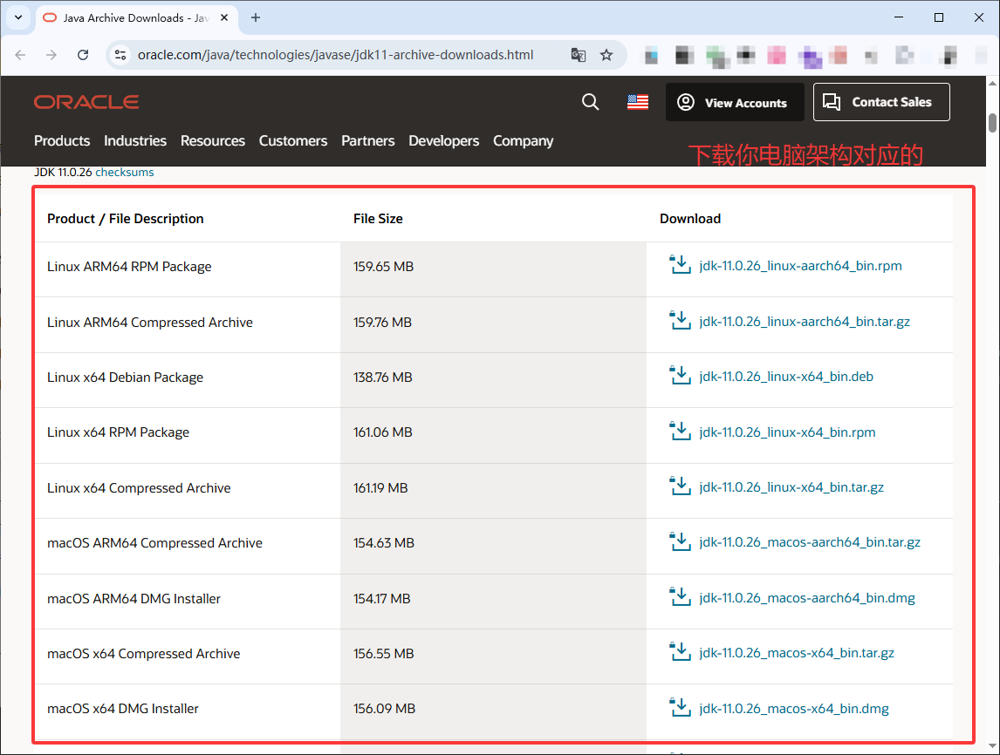
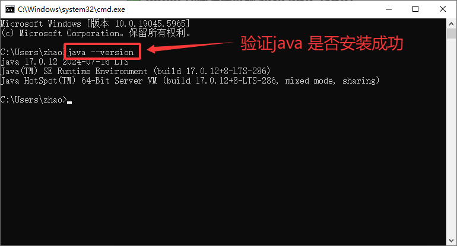
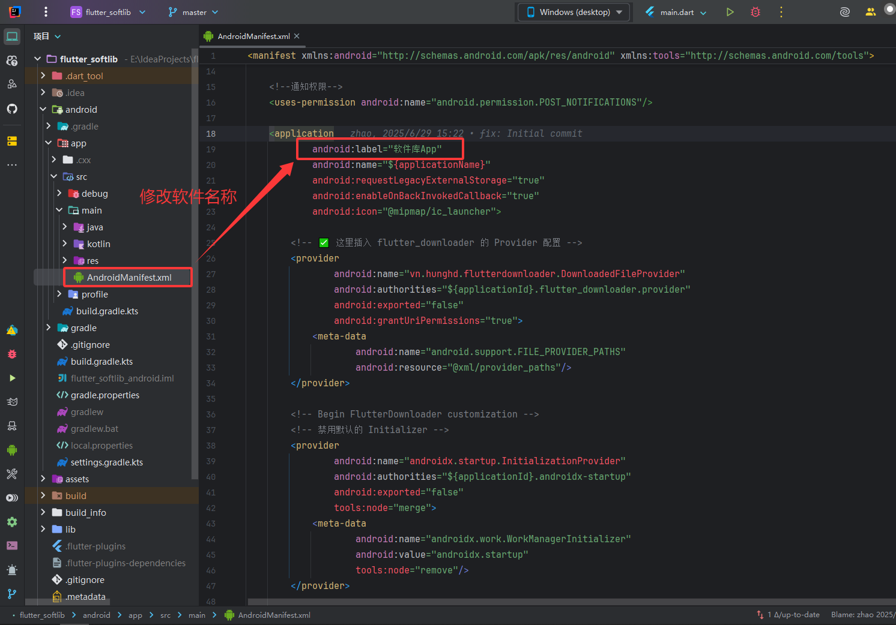
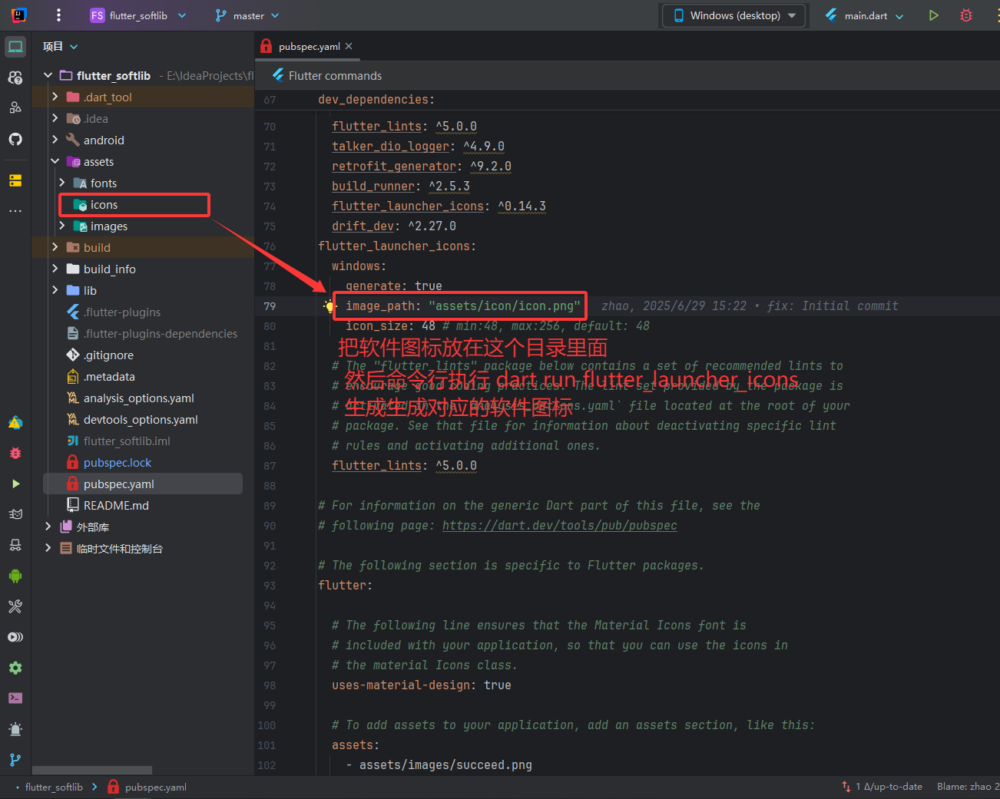
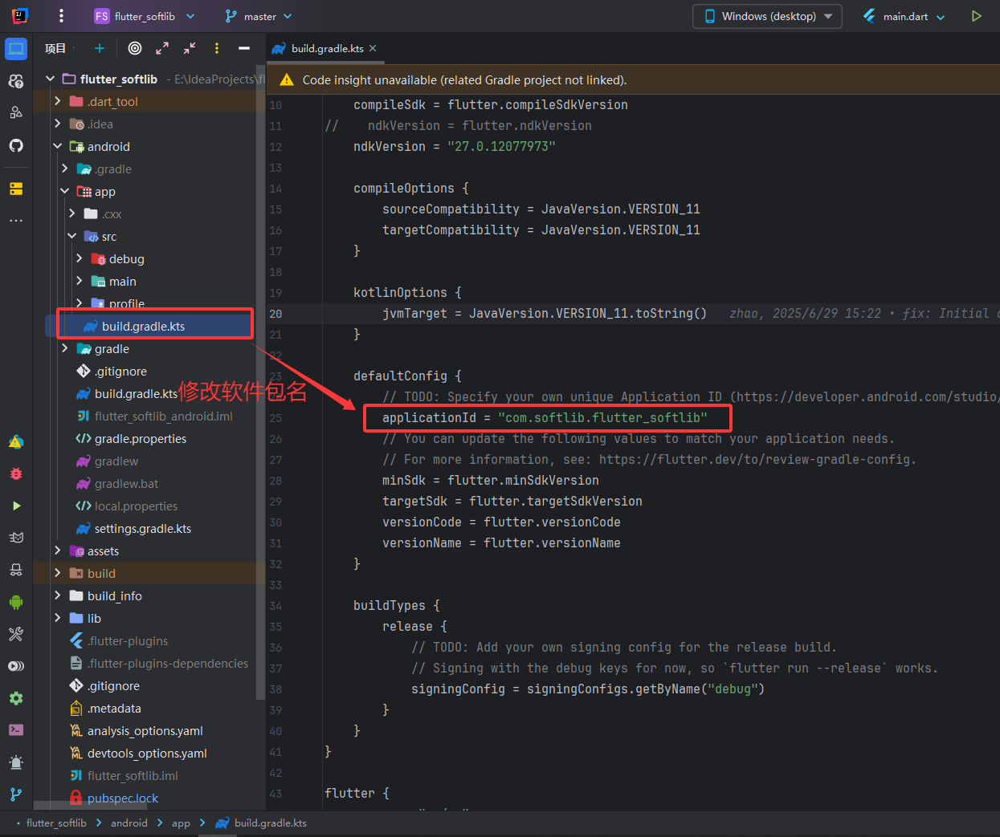
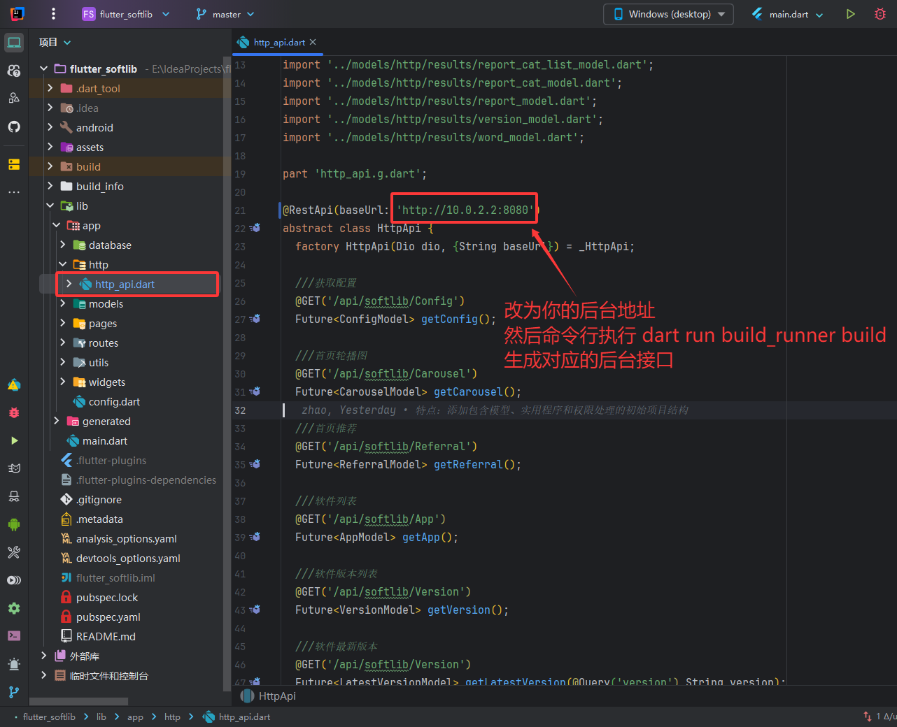

# Flutter SoftLib

<p align="left">
  <a href="https://github.com/zhao004/flutter_softlib">
    
  </a>
  <a href="https://flutter.dev">
    
  </a>
  <a href="https://dart.dev">
    
  </a>
</p>

[简体中文](README.zh-CN.md) | [English](README.en.md)

## Important Notice

This repository is an open-source learning project.

- Learning purpose: it demonstrates Flutter application development, download management, and Android packaging workflows.
- Compliance: make sure every use of this project complies with local laws and regulations.
- No illegal use: do not use this project for unlawful activities.
- Disclaimer: the author is not responsible for any consequences caused by using this project.

## Overview

Flutter SoftLib is an Android-oriented Flutter sample app that includes home recommendations, categorized software browsing, resource search, tips/article reading, download management, and version update prompts.

- Home: carousel, notices, and official recommendations.
- Apps: category switching, app details, resource search, and download task management.
- Tips: category list, article reading, and image preview.
- System: startup permission request, update prompt, and persisted download records.

## Tech Stack

- Flutter + Material 3
- GetX
- Dio + Retrofit
- Drift
- Flutter Downloader
- FlexColorScheme / EasyLoading

## Backend

- Open-source backend: [php_softlib_fastadminplugs](https://github.com/zhao004/php_softlib_fastadminplugs)

## Tested Environment

The project has been verified with the following environment:

- Flutter `3.38.7` (stable)
- Dart SDK `>=3.10.0 <4.0.0`
- Java `11+`
- Android SDK `36.1.0`
- Android Studio `2024.3.2`
- Windows 11 or newer

## Preview


## Quick Start

### 1. Install Flutter SDK

- Download: [Flutter SDK Archive](https://docs.flutter.dev/install/archive)



- Verify the installation with:

```shell
flutter --version
```



### 2. Install Java SDK

- Download: [Java SDK](https://www.oracle.com/java/technologies/javase/jdk11-archive-downloads.html)



- Verify the installation with:

```shell
java --version
```



### 3. Install dependencies and run

Run the following commands from the project root:

```shell
flutter pub get
flutter run
```

## Common Customization

### Change the app name

- Prefer `build.bat` for a guided setup.
- For manual changes, update `android:label` in `android/app/src/main/AndroidManifest.xml`.



### Change the app icon

- Put the icon asset at `assets/icon/icon.png`.
- Run this command from the project root:

```shell
dart run flutter_launcher_icons
```



### Change the package name

- Prefer entering the new package name through `build.bat`.
- For manual changes, update both `applicationId` and `namespace` in `android/app/build.gradle.kts`.



### Configure app signing

- `build.bat` can generate `key.properties` interactively.
- For manual setup, complete the standard Android signing configuration inside the `android/` project.

### Configure the backend URL

- Update `@RestApi(baseUrl: '...')` in `lib/app/http/http_api.dart`.
- Then regenerate the Retrofit code with:

```shell
dart run build_runner build --delete-conflicting-outputs
```



## Build Options

### Option 1: `build.bat` (Recommended)

`build.bat` provides a one-stop interactive build flow for Windows and will:

- Check Flutter, Java, and Android SDK.
- Run `flutter pub get`.
- Configure the app name, version, and package name.
- Configure the backend URL and run `build_runner`.
- Optionally generate app icons.
- Optionally generate `key.properties`.
- Output Debug / Release / Obfuscate Release APK files.

Run it with:

```bat
build.bat
```

### Option 2: Manual build

After finishing the required configuration, run these commands from the project root:

```shell
# Quick local validation
flutter build apk --debug

# Obfuscated arm64 release build
flutter build apk --release --target-platform android-arm64 --obfuscate --split-debug-info=./build_info

# Standard arm64 release build
flutter build apk --target-platform android-arm64
```

## Project Layout

```text
android/                    Android project and packaging configuration
assets/                     Images, icons, and documentation screenshots
lib/
  app/
    database/               Drift database and download task tables
    http/                   Retrofit API definitions and generated files
    pages/                  Home, apps, search, details, and tips pages
    widgets/                Reusable app list and tips list widgets
build.bat                   One-click Windows build script
pubspec.yaml                Flutter dependencies and app configuration
```

## Video Tutorial

- [Bilibili: Flutter packaging related videos](https://search.bilibili.com/all?keyword=flutter%20%E6%89%93%E5%8C%85)

## License

Released under the [MIT License](LICENSE).

Please use this project responsibly and lawfully.
