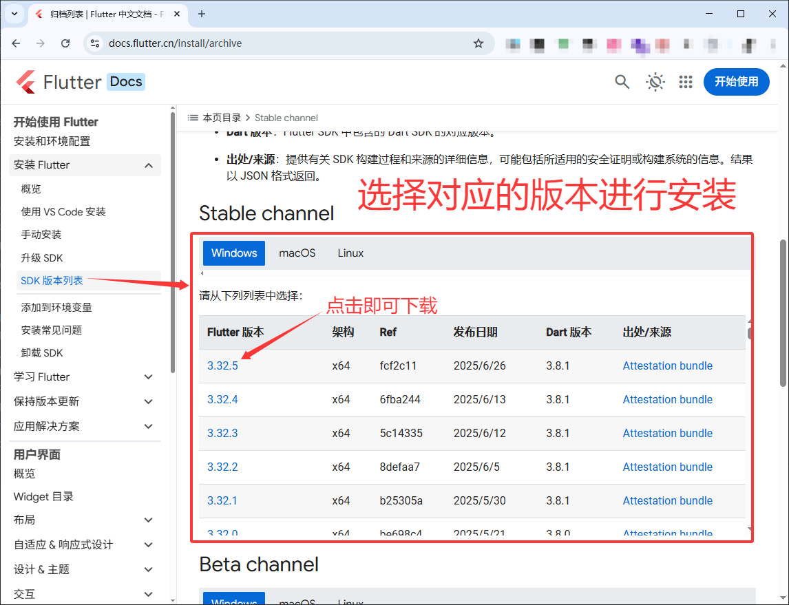
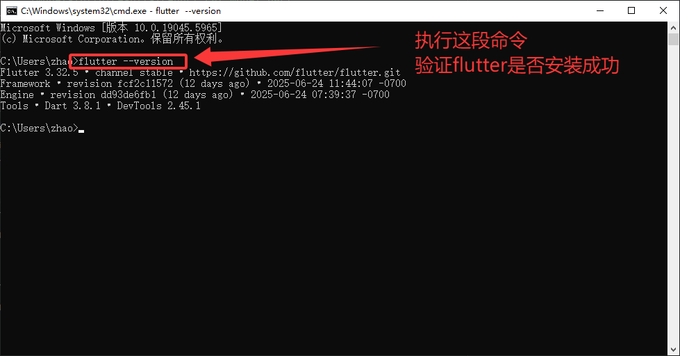
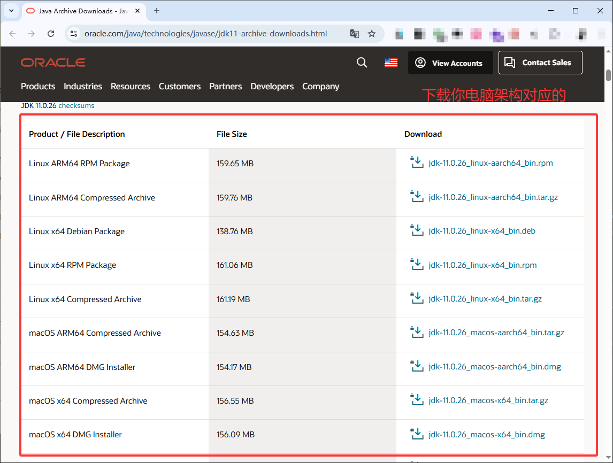
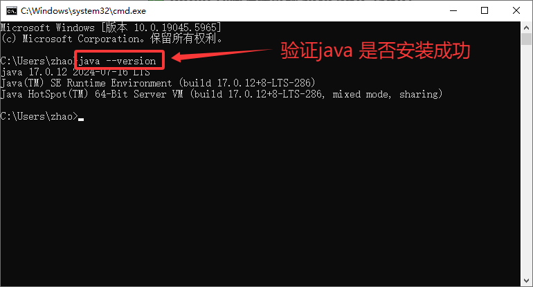
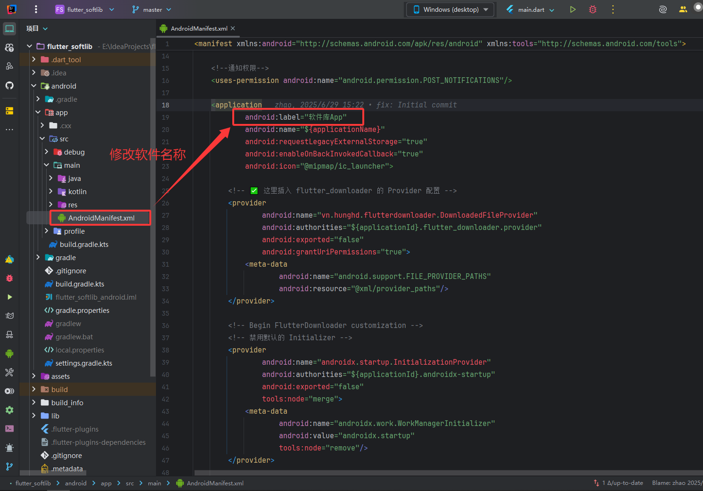
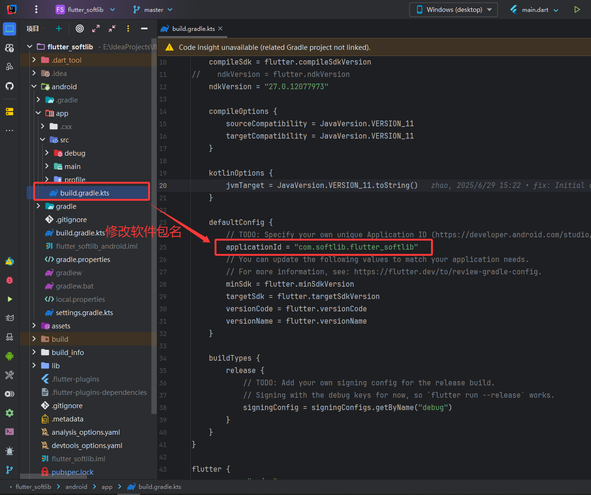
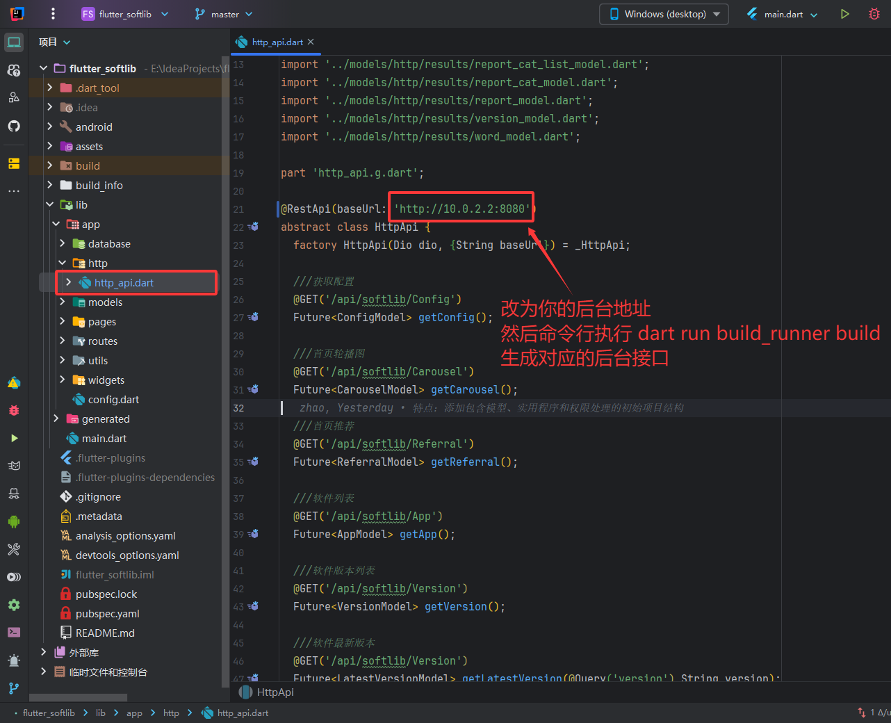

# Flutter SoftLib

## **[软件库后端开源地址](https://gitee.com/zhao004/softlib)**

一个基于Flutter开发的软件库应用程序。


## ⚠️ 重要声明

**本项目为开源学习项目。**

- 🎓 **学习用途**：本项目旨在展示Flutter开发技术和最佳实践
- 🚫 **禁止非法使用**：严禁将本项目用于任何非法活动
- 📝 **免责声明**：开发者不对使用本项目造成的任何后果承担责任
- 🔒 **合规使用**：使用者需确保遵守当地法律法规

# Flutter环境

```textmate
[√] Flutter (Channel stable, 3.38.7, on Microsoft Windows [版本 10.0.26200.7623], locale zh-CN)
[√] Windows Version (Windows 11 or higher, 25H2, 2009)
[√] Android toolchain - develop for Android devices (Android SDK version 36.1.0)
[√] Android Studio (version 2024.3.2)
[√] Connected device (3 available)
[√] Network resources
```


## 视频教程

### [哔哩哔哩](https://search.bilibili.com/all?keyword=flutter%20%E6%89%93%E5%8C%85)

## 部分步骤

### 下载 **[Flutter SDK](https://docs.flutter.cn/install/archive)**



**下载安装后执行 `flutter --version` 验证是否安装成功**



### 下载 **[Java SDK](https://www.oracle.com/java/technologies/javase/jdk11-archive-downloads.html)**


**下载安装后执行 `java --version` 验证是否安装成功**


### 修改软件名称



### 修改软件图标

当前项目下终端执行：`dart run flutter_launcher_icons`


### 修改软件包名



### 配置软件签名

**自己去百度搜索Android 项目签名配置**

### 配置后台地址

当前项目下终端执行：`dart run build_runner build --delete-conflicting-outputs`




## 编译方式

本项目提供两种编译方式，推荐使用脚本编译以减少手动配置步骤。

### 方式一：build.bat脚本编译（推荐）

脚本包含完整流程：环境检测、软件名称/版本/包名配置、后台地址、图标生成、签名配置、编译输出。

运行方式：

```bat
:: 方式1：双击 build.bat

:: 方式2：命令行运行
cd /d D:\project\flutter_softlib
build.bat
```

### 方式二：手动配置编译

按需手动修改配置后，执行下面的编译命令。

## 编译指令 编译arm64架构的apk(这个架构支持大部分安卓手机,不支持模拟器)

```shell
# 本地快速验证
flutter build apk --debug
# 混淆打包
flutter build apk --release --target-platform android-arm64 --obfuscate --split-debug-info=./build_info
# 正常打包
flutter build apk --target-platform android-arm64
```


## 许可证

本项目基于 [MIT License](LICENSE) 开源协议。

**请合理使用，共同维护开源社区环境！**

[//]: # (# 问题反馈群,有什么问题可以在群里反馈,大家一起交流,一起提升技术)

[//]: # (![qrcode_1751853555740.jpg]&#40;assets/images/example/qrcode_1751853555740.jpg&#41;)
